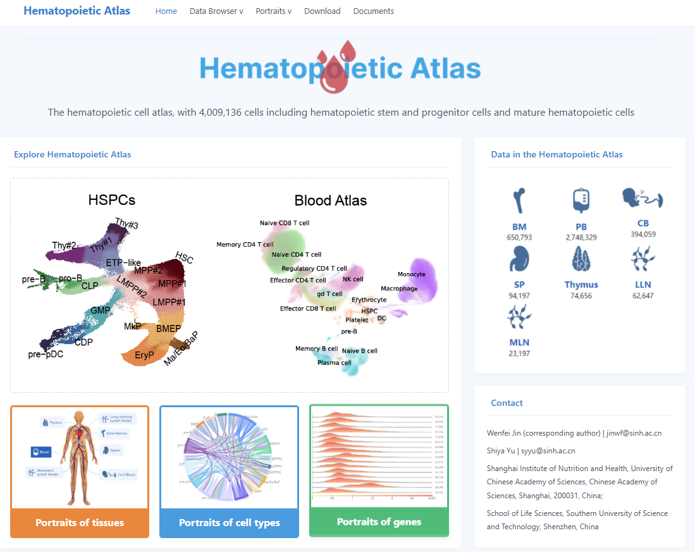

The hematopoietic cell atlas, with 4,009,136 cells including hematopoietic stem and progenitor cells and mature hematopoietic cells

Data browser

Data browser incorporates two cellxgene plug-ins, offering interactive visualization interfaces for integrated data on both hematopoietic stem and progenitor cell atlas and mature hematopoietic cell atlas.

Portraits of hematopoietic Atlas

Portraits of tissues provides the description of the tissue functioning in hematopoiesis in tissue scale. We calculate the highly expressed genes across tissues and visualize results in molecular scale.

Portraits of cell types provides the proportion distribution across the tissues in tissue scale and calculate the highly expressed genes of the main cell types across tissues in molecular scale. The results of cell-cell interaction are shown in the corresponding scale.

Portrait of genes provides gene introduction, the expression distribution of the selected gene across tissues and cell types in the corresponding scale.

Download

Download provides raw data of integrated datasets. Users could use this to access to original papers and data.

Documents

Documents shows the overview of this website and user guides.

# 🧬 Hematopoietic Cell Atlas Data Platform

> Welcome to the official repository and documentation for the **Hematopoietic Cell Atlas** website. This platform provides comprehensive single-cell resolution data, interactive visualization tools, and multi-scale insights into hematopoietic stem/progenitor cells and mature hematopoietic cells, encompassing a massive dataset of **4,009,136 cells**.

---

## 🚀 Key Features & Modules

### 1. 📊 Data Browser
Powered by two integrated **cellxgene** plug-ins, the Data Browser offers powerful, interactive visualization interfaces for exploring the integrated datasets:
* **Hematopoietic Stem and Progenitor Cell Atlas**
* **Mature Hematopoietic Cell Atlas**

### 2. 🖼️ Portraits of Hematopoietic Atlas
A multi-scale analytical framework designed to explore hematopoiesis from different biological dimensions:
* **Portraits of Tissues**: Explores tissue-level functions in hematopoiesis, featuring calculated highly expressed genes across tissues visualized at the molecular scale.
* **Portraits of Cell Types**: Illustrates proportional cell distributions across tissues (tissue scale), identifies highly expressed genes for major cell types, and visualizes cell-cell interactions.
* **Portrait of Genes**: Provides detailed gene introductions along with expression distribution profiles across various tissues and cell types.

### 3. 📥 Download
* Access and download raw data from integrated datasets.
* Direct links and references to original research papers and source data.

### 4. 📚 Documents
* Comprehensive website overview.
* Step-by-step user guides and documentation.

---

## 🛠️ Quick Links
* **Website Home**: [index.pnh](#)
* **Data Exploration**: [Data Browser](#)
* **User Guides**: [Documents](#)
